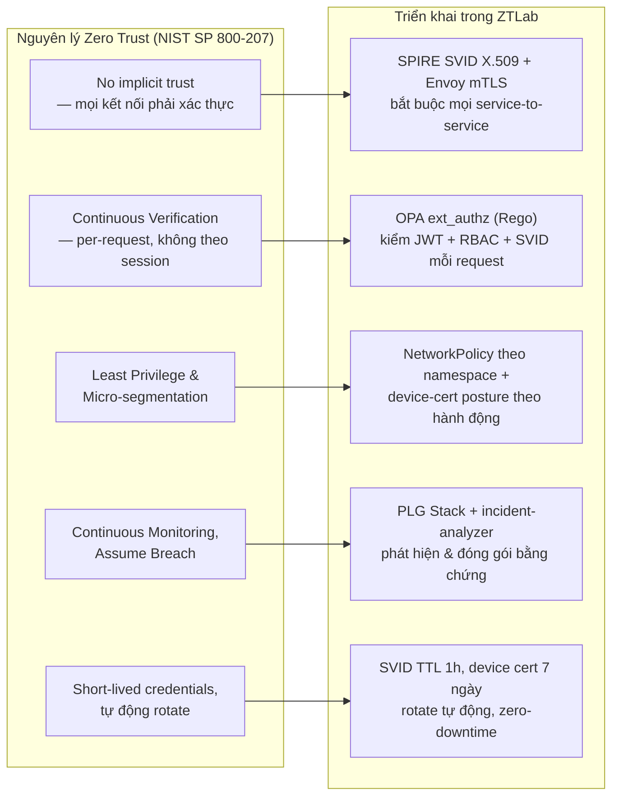
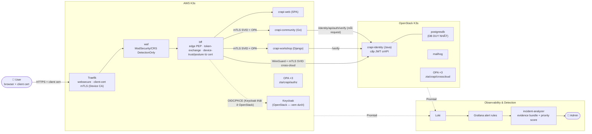

# ZTLab — Zero Trust Security Detection & Response

ZTLab là một **testbed thực nghiệm** hiện thực hoá các nguyên lý Zero Trust Architecture (NIST SP 800-207) trên một hệ microservices triển khai thật trên hai cloud (AWS + OpenStack), thay vì mô phỏng trên giấy hay chạy trên một cụm đơn lẻ. **Ứng dụng mục tiêu là [OWASP crAPI](https://github.com/OWASP/crAPI)** (Completely Ridiculous API — một ứng dụng cố tình chứa lỗ hổng để học API security). Luồng vận hành: user đăng nhập qua Keycloak OIDC/PKCE tại **BFF** (điểm vào duy nhất, sau WAF ModSecurity/CRS DetectionOnly), qua Traefik với **client-certificate mTLS bắt buộc** (Device CA riêng, posture nhúng trong cert) — BFF mint token crAPI-native + forward token Keycloak; mọi hop service-to-service bị Envoy sidecar + OPA ext_authz chặn trước khi tới đích, xác thực bằng SVID do SPIRE cấp; `crapi-identity` + toàn bộ dữ liệu nằm ở OpenStack, các service tiêu thụ ở AWS, nối nhau qua mTLS + WireGuard. Log từ cả hai cloud đổ về PLG Stack (Promtail → Loki → Grafana); khi Grafana phát hiện mẫu tấn công đã định nghĩa, **`incident-analyzer`** đóng gói bằng chứng (log OPA/Envoy/BFF/WAF quanh thời điểm cảnh báo) + chấm điểm ưu tiên rồi gửi email cho admin — **không tự thực thi hành động nào trên cluster** (SOAR execution đã bị bỏ — quyết định A4, xem `HE-THONG-CHI-TIET.md` §7.3).

**Cần nói rõ ngay từ đầu:** (1) đây không phải sản phẩm bảo mật cắm-là-chạy — policy OPA, alert Grafana, rule WAF viết cứng cho đúng tập endpoint/service của hệ này. (2) **crAPI giữ NGUYÊN các lỗ hổng tầng ứng dụng** (BOLA, BFLA, JWT confusion, SSRF, mass assignment…) — đó là chủ đích. Đóng góp của ZTLab là **lớp Zero-Trust + phát hiện/phân tích bao quanh**: chặn lateral movement, privilege escalation qua network, credential replay, ép step-up, và phát hiện → đóng gói bằng chứng khi lỗ hổng app bị khai thác. Xem chi tiết đầy đủ ở **`HE-THONG-CHI-TIET.md`**.

---

## Nguyên lý Zero Trust & phạm vi đóng góp

### Vì sao Zero Trust — cho vấn đề gì, không phải "bảo mật" chung chung

Zero Trust là một tập nguyên lý rất rộng (identity, network, device, data, application, analytics...) — nói "áp Zero Trust để bảo mật hơn" là một câu gần như vô nghĩa, vì bất kỳ kiểm soát bảo mật nào (WAF, IDS, mã hoá, patch quản lý...) cũng "bảo mật hơn". Câu hỏi cần trả lời cụ thể hơn: **Zero Trust giải quyết đúng loại lỗ hổng nào mà các mô hình khác về cấu trúc không giải quyết được?**

Mô hình *perimeter-based* (kể cả bản nâng cấp bằng VPC/security group/VPN) đặt giả định: một khi request đã ở "bên trong" ranh giới mạng đã được xác thực (đã qua firewall, đã trong cùng VPC, đã qua VPN), các thực thể bên trong tin tưởng lẫn nhau theo mặc định — trust được cấp theo **vị trí mạng**, không theo **danh tính đã xác minh của từng request**. Với microservices, đây chính là lỗ hổng cấu trúc: nếu một service bị chiếm quyền (dependency độc hại, RCE, credential leak...), kẻ tấn công đã "ở trong ranh giới" và có thể gọi tự do sang service khác — *lateral movement* — mà không kiểm soát nào ở tầng perimeter phát hiện được, vì về bản chất traffic đó chưa từng "vượt biên giới" để bị soi.

Zero Trust (cụ thể là NIST SP 800-207) nhắm thẳng vào đúng lỗ hổng này bằng cách bỏ hẳn khái niệm "network location = mức trust", thay bằng **identity verification + policy evaluation cho từng request, kể cả traffic nội bộ (east-west)** — kiến trúc chuẩn cho việc này là một **Policy Decision Point (PDP)** tách biệt (ở đây là OPA) đưa ra quyết định allow/deny, và **Policy Enforcement Point (PEP)** (Envoy sidecar) là nơi thực thi quyết định đó tại chỗ, ngay cạnh workload. ZTLab không cố hiện thực hoá toàn bộ 7 tenet của SP 800-207 dàn trải — phạm vi thu hẹp có chủ đích vào các tenet có thể đo lường được bằng thực nghiệm: tenet 2 (secure communication regardless of location), tenet 3 + 6 (per-session/per-request authorization, enforced before access), và một phần tenet 4 (dynamic policy) — xem bảng ánh xạ đầy đủ bên dưới.

### Vì sao những lựa chọn thiết kế còn lại

Mỗi lựa chọn dưới đây là một điều kiện cần để câu hỏi nghiên cứu ở trên "có ý nghĩa để kiểm chứng", không phải lựa chọn tuỳ ý:

- **Vì sao microservices, không phải monolith?** Lateral movement — vấn đề cốt lõi Zero Trust nhắm tới — không tồn tại trong một monolith (không có ranh giới mạng nội bộ để "di chuyển" qua). Microservices là điều kiện cần để có một bề mặt service-to-service thật sự cần kiểm chứng: nếu không có nhiều service độc lập gọi nhau qua mạng, câu hỏi "policy per-request có chặn được lateral movement không" không thể đặt ra.
- **Vì sao OWASP crAPI, không phải app tự viết?** Ba lý do: (1) crAPI là ứng dụng **có thật, có cộng đồng**, nhiều microservice độc lập (identity/community/workshop) gọi nhau qua mạng — bề mặt service-to-service thật sự cần kiểm chứng lateral movement, không phải app đồ chơi; (2) crAPI **cố tình chứa lỗ hổng tầng ứng dụng** (BOLA, BFLA, JWT confusion, SSRF…) → tạo được kịch bản "lỗ hổng app bị khai thác" **thật** để đo lớp phát hiện/phản ứng, thay vì phải tự chèn lỗ hổng giả; (3) crAPI có RBAC tự nhiên (user/mechanic/admin) khớp mô hình phân quyền OPA. Trục "dynamic policy" (tenet 4) ở đây thể hiện bằng **device-trust + device-posture + step-up OTP + RBAC + trạng thái SVID** (không còn trục amount/velocity như app tài chính cũ).
- **Vì sao hybrid multi-cloud (AWS + OpenStack), không phải một cloud/VPC?** Trong một cloud/VPC duy nhất, security group và IAM sẵn có của nhà cung cấp đã tạo ra một phần ranh giới tin cậy — rất khó tách bạch "cái gì do lớp Zero Trust tự xây tạo ra, cái gì do IAM/SG của cloud provider cho sẵn". Hai cloud có mô hình mạng và IAM khác hẳn nhau (AWS VPC quản lý vs OpenStack tự vận hành) buộc lớp Zero Trust (SPIFFE trust domain dùng chung 1 root CA, WireGuard nối tầng mạng, OPA policy nhất quán) phải tự chịu trách nhiệm toàn bộ việc thiết lập trust xuyên biên giới — cô lập đúng phần đóng góp của kiến trúc đang được kiểm chứng, không lẫn với hạ tầng có sẵn.
- **Vì sao tự dựng VM + Terraform/Ansible/K3s, không dùng PaaS/SaaS quản lý sẵn (EKS+App Mesh, managed Istio, Auth0/Cognito...)?** Vì câu hỏi nghiên cứu chính là *chi phí vận hành thật của việc thêm lớp Zero Trust là bao nhiêu* — nếu dùng dịch vụ quản lý sẵn, chính phần cần đo (latency OPA eval, chi phí cấp/xoay SVID, độ phức tạp giữ pipeline tái tạo được) sẽ nằm trong control plane đóng của nhà cung cấp, không đo được, không giải thích được. Tự dựng từng lớp (SPIRE server/agent, Envoy sidecar, OPA) khiến mọi thứ minh bạch và đo được. Việc này cũng phản ánh gần hơn với thực tế triển khai của nhiều tổ chức tài chính có ràng buộc chủ quyền dữ liệu/pháp lý buộc phải giữ một phần hạ tầng tự vận hành (private cloud kiểu OpenStack) thay vì toàn bộ trên PaaS công cộng.
- **Vì sao NIST SP 800-207, không phải Forrester ZTX hay BeyondCorp?** SP 800-207 là chuẩn liên bang Mỹ, trung lập vendor, được CISA và DoD Zero Trust Reference Architecture dẫn chiếu làm nền — khác với các khung thương mại (Forrester ZTX là sản phẩm tư vấn) hay case study riêng của một hãng (BeyondCorp mô tả triển khai nội bộ của Google, không phải chuẩn tổng quát). Quan trọng hơn: SP 800-207 định nghĩa Zero Trust bằng **tenet** (thuộc tính hệ thống phải có) chứ không quy định sản phẩm cụ thể — cho phép kiểm chứng theo kiểu "hệ thống có đạt tenet X hay không" một cách khách quan, thay vì đối chiếu với tiêu chí mơ hồ.

### Khác gì so với các tính năng Zero Trust có sẵn trên cloud

Cả AWS, GCP, Azure đều bán sản phẩm gắn mác "Zero Trust" — cần nói rõ vì sao dựng riêng thay vì dùng thẳng, nếu không phần lý luận ở trên sẽ bị hiểu nhầm là làm lại thứ đã có sẵn. Điểm khác biệt nằm ở **ranh giới bài toán mà từng loại sản phẩm giải quyết**, không phải mức độ "Zero Trust" nhiều hay ít:

- **ZTNA (Zero Trust Network Access) — AWS Verified Access, GCP BeyondCorp Enterprise, Azure AD Conditional Access:** nhóm sản phẩm này giải quyết bài toán *user-to-app* — thay thế VPN cho người dùng/nhân viên truy cập ứng dụng nội bộ, dựa trên identity provider + device posture. Đây **không phải** bài toán ZTLab nhắm tới. ZTLab tập trung vào *workload-to-workload* (service gọi service, east-west traffic sau khi request đã vào trong cluster) — một lớp hoàn toàn khác, thường do sản phẩm khác của chính cloud đó đảm nhiệm (xem mục tiếp theo), và thường ít được gắn mác "Zero Trust" trong marketing dù về bản chất mới là nơi lateral movement thật sự xảy ra.
- **Service mesh managed — AWS App Mesh, GCP Anthos Service Mesh (đều dựa trên Envoy/Istio):** đây mới là nhóm gần nhất với những gì ZTLab làm (sidecar proxy, mTLS, policy). Khác biệt chính: các dịch vụ managed này **chạy trong một cloud, gắn với control plane của chính cloud đó** — không có sản phẩm managed nào của AWS mở rộng identity/policy sang một workload đang chạy trên OpenStack. SPIFFE/SPIRE giải quyết đúng khoảng trống này: `trust domain` của SPIFFE là một khái niệm **độc lập với cloud provider**, một workload ở AWS và một workload ở OpenStack xác minh lẫn nhau bằng chứng chỉ ký bởi cùng 1 root CA, không cần gọi lại API của bất kỳ cloud nào để verify.
- **IAM-based service-to-service auth — AWS IAM roles, resource policies, VPC Lattice:** cách phổ biến để một service AWS gọi service AWS khác "an toàn" là dùng IAM role assumption — nhưng đây là một dạng trust đặt vào **control plane của cloud provider** (STS, IAM), không phải một danh tính cryptographic độc lập, tự-chứng-minh (self-contained) như SPIFFE SVID (X.509 cert, verify được ngay tại chỗ, không cần round-trip gọi ngược lại IAM). Khác biệt này chỉ thật sự quan trọng khi hai bên giao tiếp **không thuộc cùng một control plane** — đúng tình huống hybrid-cloud của ZTLab, không quan trọng nếu chỉ chạy trong 1 AWS account.
- **Policy-as-code tập trung (OPA/Rego) so với IAM policy JSON rải rác theo từng resource:** IAM policy attach vào từng role/resource riêng lẻ — muốn biết "ai được làm gì" phải tổng hợp từ nhiều nơi. OPA tách hẳn quyết định phân quyền ra một service riêng (Policy Decision Point), một file Rego là nguồn sự thật duy nhất, version-control được, test được độc lập với hạ tầng — gần với triết lý "Policy as Code" hơn là "Infrastructure Configuration".

**Những gì cloud-native ZT làm tốt mà ZTLab không cố làm lại:** device posture/health attestation tích hợp EDR (CrowdStrike, Jamf...), identity federation quy mô doanh nghiệp (SSO hàng chục nghìn user), DDoS/edge protection, và — quan trọng nhất — **vận hành dưới dạng managed service** (không phải tự vá lỗi deploy mỗi lần dựng lại). ZTLab đánh đổi sự tiện lợi đó để lấy khả năng đo lường và tính di động xuyên hạ tầng — một đánh đổi có chủ đích, không phải vì không biết tới các sản phẩm cloud-native.

### Zero Trust áp dụng ở lớp nào, và ZTLab có phải "khung giải pháp mới" không

**Không.** ZTLab không đề xuất một mô hình Zero Trust mới — nó là một **hiện thực hoá cụ thể** của SP 800-207 bằng các thành phần mã nguồn mở sẵn có (SPIFFE/SPIRE, OPA, Envoy, Traefik mTLS, WAF ModSecurity/CRS, Grafana, `incident-analyzer` tự viết), áp dụng có chọn lọc, không đều, lên 7 tenet gốc:

| # | Tenet (NIST SP 800-207) | ZTLab có làm không | Bằng gì |
|---|---|---|---|
| 1 | *All data sources and computing services are considered resources* | Một phần | OPA phân biệt `internal_service_request` (có SVID) vs `external_api_request` (không SVID) theo **danh tính đã xác minh** (identity), không theo IP/network location — đúng tinh thần tenet, nhưng vẫn là một dạng phân loại request, không xử lý "mọi resource hoàn toàn như nhau" |
| 2 | *All communication is secured regardless of network location* | Có | mTLS bắt buộc mọi service-to-service qua Envoy + SPIRE SVID, kể cả cross-cloud qua WireGuard tunnel |
| 3 | *Access to resources is granted on a per-session basis* | Có | SVID TTL 1 giờ, auto-rotate; mỗi request đi qua OPA ext_authz riêng biệt — không có khái niệm "authenticated once, trusted thereafter" |
| 4 | *Access determined by dynamic policy* (identity, app, asset, behavioral attributes) | Một phần | OPA dùng role (RBAC crapi-user/mechanic/admin) + trạng thái SVID + **device-posture/device-trust từ client certificate thật** (Device CA, SAN URI định danh + Subject OU posture, Traefik `RequireAndVerifyClientCert`) + **step-up OTP** (`acr=high`) cho hành động nhạy cảm — nhưng chưa có health attestation tích hợp EDR |
| 5 | *Monitor and measure the integrity/security posture of all assets* | Một phần | `security-scanner-job.yaml` + `posture-agent` CronJob (ns crapi) kiểm tra container posture (uid, Linux capabilities, ảnh unpinned); Gatekeeper admission chặn container vi phạm — nhưng vẫn chủ yếu *phát hiện*, không tự thực thi hành động khắc phục (xem mục "ZTLab đóng góp gì" — SOAR execution đã bị bỏ) |
| 6 | *Authentication/authorization are dynamic and strictly enforced before access* | Có | Istio CUSTOM AuthorizationPolicy → OPA ext_authz **fail-closed** (OPA lỗi/timeout → 503, không fail-open); xác nhận thật bằng `tests/chaos_opa_failover.sh` |
| 7 | *Collect information on assets/network state to improve security posture* | Có | PLG Stack + OPA decision log (`decision_id` riêng từng decision) + istio access log (có SVID peer) + BFF audit log + WAF audit log + `incident-analyzer` evidence bundle — dùng để detect, phân tích, điều chỉnh policy |

Diễn giải bảng trên bằng một câu: ZTLab làm tốt các tenet thuộc phạm trù *identity + network + policy enforcement* (2, 3, 6, một phần 4), còn tenet thuộc phạm trù *device/asset posture* (5) mới dừng ở mức thủ công/one-off — đây không phải sơ suất che giấu mà là ranh giới phạm vi có chủ đích của một đồ án quy mô lab, đã nói rõ ở phần "ZTLab đóng góp gì" bên dưới.

Gộp các tenet có liên quan lại thành 5 nhóm nguyên lý thực hành (không phải một danh sách cạnh tranh với bảng 7 tenet ở trên — chỉ là cách trình bày cô đọng hơn cho sơ đồ), ánh xạ sang từng thành phần cụ thể đang chạy:



### ZTLab đóng góp gì — và không đóng góp gì

Cần tách bạch hai loại tuyên bố dễ bị nhầm lẫn với nhau:

1. *"Hệ thống này chặn được N request tấn công trong bài test"* — đây là **kết quả thực nghiệm có thật**, đo được (`tests/crapi_*.sh`, kết quả trong `SAN-SANG-GIAI-DOAN-B.md` và `AUDIT-THUC-THI.md` §6).
2. *"Hệ thống này làm giảm tấn công / tăng bảo mật"* — đây là một tuyên bố **không có nghĩa** ở phạm vi một lab/testbed đơn lẻ. ZTLab không bảo vệ bất kỳ tài sản thật nào ngoài chính nó; nó không phải một control có thể "lắp vào" một hệ thống khác để hệ thống đó an toàn hơn. Toàn bộ Rego policy (`opa/crapi-policies/`), alert rule Grafana (`plg-stack/grafana/alerting/`), và WAF rule (`k8s/crapi/waf.yaml`) đều viết cứng theo đúng tên endpoint/service/namespace của riêng hệ thống này — di chuyển nguyên trạng sang một codebase khác sẽ không hoạt động, phải viết lại từ đầu theo bề mặt tấn công (attack surface) của hệ thống đích. Chính lần migration finance-app → crAPI (ghi lại trong lịch sử git của dự án) là minh chứng: đổi ứng dụng mục tiêu buộc viết lại toàn bộ `service-graph`, policy, alert rule, script tấn công.

Vậy giá trị thực của dự án nằm ở đâu, nếu không phải "giảm tấn công"? Ba điểm, xếp theo mức độ chắc chắn giảm dần:

**1. Bằng chứng thực nghiệm về operational feasibility — và về cái giá thật của nó.** Đóng góp **không phải** "ZTLab là một hệ thống chạy được" — một artifact chạy được không phải kết quả nghiên cứu, và pipeline này **không** tự chạy trơn tru qua các lần destroy/redeploy: mỗi lần dựng lại từ số 0 đều lộ ra lỗi mới chỉ xuất hiện ở đường fresh-deploy (SSH host-key sau khi VM đổi IP, `docker save` ảnh multi-arch hỏng khi `ctr import`, DNS/WireGuard chết vì uplink drop UDP → SPIRE/mТLS sập dây chuyền — xem `HE-THONG-CHI-TIET.md` §10.2). Đóng góp thật nằm ở **quá trình lặp lại thực nghiệm đó**: lắp SPIFFE/SPIRE + OPA (PDP) + Istio/Envoy (PEP) + PLG/incident-analyzer (vòng lặp detect–analyze) thành một pipeline xuyên hai cloud có mô hình mạng/IAM khác hẳn nhau, rồi *đo lại chính xác nó gãy ở đâu và vì sao* — dữ liệu về chi phí kỹ sư thật của Zero Trust mà phần lớn tài liệu SP 800-207 (dừng ở nguyên lý trừu tượng) không đề cập.

**2. Số liệu chi phí runtime.** Câu hỏi "áp Zero Trust thì tốn thêm bao nhiêu mỗi request?" thường chỉ được trả lời định tính. `tests/perf_overhead.py` / `tests/collect_metrics.py` đo cho *chính kiến trúc này*: overhead latency lớp mТLS + OPA ext_authz (per-request), CPU/RAM steady-state của SPIRE/OPA/incident-analyzer. Hữu ích cho người *đang cân nhắc* áp dụng kiến trúc tương tự — không phải bằng chứng "có Zero Trust thì an toàn hơn". *(Các script đo này hiện còn tham chiếu tên service của app cũ — cần cập nhật trước khi chạy lại cho crAPI.)*

**3. Giới hạn của cách tiếp cận — cũng là một phần đóng góp, không phải điểm trừ cần giấu.** Lớp detection dựa hoàn toàn trên rule tĩnh (LogQL ngưỡng cố định) — không học pattern mới, không phân biệt tấn công chậm/rải rác, và **không suy rộng ra ngoài các kịch bản đã định nghĩa**: kỹ thuật không khớp LogQL nào sẽ đi qua không dấu vết. Ngược lại, OPA **có** tự verify chữ ký JWT của người dùng (Keycloak JWKS + OIDC discovery) — khác với bản finance-app trước đây giao việc đó cho tầng ứng dụng. Ghi nhận rõ giới hạn theo-thiết-kế quan trọng hơn quảng bá "chặn 100% trong bài test".

Tóm lại: ZTLab nên được đọc như **một nghiên cứu thực nghiệm về tính khả thi và chi phí vận hành** của Zero Trust Architecture trong bối cảnh microservices đa cloud, kèm bộ số liệu đo được làm minh chứng — chứ không phải một sản phẩm, một bộ policy tái sử dụng được, hay một tuyên bố về hiệu quả phòng thủ trong thực tế sản xuất.

---

## Kiến trúc



**Stack:**
- **Identity:** Keycloak OIDC/PKCE (đặt trên OpenStack cùng dịch vụ định danh — Nghị định 53, realm `ztlab`, role crapi-user/mechanic/admin/soc-analyst), SPIFFE/SPIRE X.509 SVID (trust domain `ztlab.local`, TTL 1h, scheme `spiffe://ztlab.local/<cloud>/<svc>`)
- **Edge/perimeter:** Traefik (websecure, `TLSOption` `RequireAndVerifyClientCert`) → WAF (ModSecurity3 + OWASP CRS, DetectionOnly — đối chứng cho luận điểm BOLA vượt qua chữ ký) → BFF. Device CA riêng (tách khỏi SPIRE root CA); cert client mang định danh (SAN URI) + posture (Subject OU) — `scripts/issue-device-cert.sh`
- **Mesh:** Istio 1.22.3 — PeerAuth STRICT + DestinationRule custom-SAN mỗi service + CUSTOM AuthorizationPolicy → OPA ext_authz
- **Policy:** OPA ×2 PDP (AWS `zta/crapi/authz/allow`, OpenStack `zta/crapi/crosscloud/allow`); `service_acl` sinh từ `policy/service-graph-crapi.yaml`
- **Edge PEP:** BFF (FastAPI) — điểm vào duy nhất, OIDC/PKCE + mint token crAPI RS256 + device-trust/posture (từ client cert đã verify) + audit
- **Target app:** OWASP crAPI Core (identity/community/workshop/web/mailhog) + Postgres×1 (OpenStack) + Mongo/Redis (AWS)
- **Observability & detection:** Promtail → Loki → Grafana; Prometheus; `incident-analyzer` (đóng gói bằng chứng + chấm điểm ưu tiên + email — không tự thực thi hành động trên cluster)

---

## Cấu trúc repo

```
terraform/          Provisioning AWS + OpenStack (IaC)
ansible/            Inventory + playbooks (baseline, k3s, wireguard, promtail)
k8s/crapi/          Manifest ứng dụng crAPI + BFF + OPA + mesh policy + NetworkPolicy
k8s/{istio,keycloak,identity,gatekeeper,vault,plg-stack,monitoring,security-monitoring,rbac,dns}/
opa/crapi-policies/ Rego: zta_crapi (authz AWS), crosscloud_crapi (OpenStack), service_acl (generated)
policy/             service-graph-crapi.yaml — nguồn sự thật cho service_acl + NetworkPolicy
spire/              SPIRE server/agent config + K8s manifest + root CA
services/           bff (edge PEP) + incident-analyzer (Dockerfile chung)
deploy/vendor/crapi-keys/  khoá JWT công khai của crAPI (bff mint bằng khoá này)
deploy/vendor/device-ca/   Device CA cho client-cert mTLS (A3) — key không commit, .gitignore
scripts/            deploy-all, deploy-app, deploy-crapi, deploy-security-stack, destroy-all,
                    ensure-spire-entries, gen-rego-acl, gen-networkpolicy, k8s-tunnel, open-admin-uis,
                    sync-app-images, issue-device-cert (phát hành client cert theo posture)
tests/              crapi_*.sh (kịch bản tấn công) + crapi_run_all + lib/ + chaos_*.sh + test_service_graph_consistency
legacy/             Cấu hình Envoy/SPIRE trước khi migrate sang Istio — tham chiếu lịch sử, KHÔNG áp dụng
HE-THONG-CHI-TIET.md  Tài liệu hệ thống đầy đủ (kiến trúc/cấu hình/module/flow)
SAN-SANG-GIAI-DOAN-B.md  Bàn giao đóng sổ hạ tầng: trạng thái cuối từng hạng mục + số liệu chốt
HAN-CHE-VA-HUONG-PHAT-TRIEN.md  Hạn chế (H1–H18) + hướng phát triển
DEPLOY.md           Quy trình triển khai + vận hành hàng ngày
```

---

## Yêu cầu trước khi deploy

Hướng dẫn cài đặt từng bước thủ công (dùng khi debug hoặc muốn hiểu rõ từng khâu) nằm ở **[DEPLOY.md](DEPLOY.md)**. Phần dưới đây chỉ tóm tắt những gì cần chuẩn bị trước.

**Công cụ** (script `deploy-all.sh` tự cài phần lớn, xem Bước 1 [DEPLOY.md](DEPLOY.md)): Ansible, Docker, kubectl, Terraform, AWS CLI, OpenStack CLI, jq, openssl, socat.

**Tài khoản cloud:** AWS IAM access key (đủ quyền tạo VPC/EC2/security group), tài khoản OpenStack (project + user đã có quota).

**Biến bắt buộc trong `.env`** (copy từ `.env.template`):

| Biến | Ý nghĩa |
|---|---|
| `AWS_ACCESS_KEY_ID` / `AWS_SECRET_ACCESS_KEY` | IAM key để Terraform provision AWS |
| `AWS_DEFAULT_REGION` | Mặc định `ap-southeast-1` |
| `OS_AUTH_URL` / `OS_USERNAME` / `OS_PASSWORD` / `OS_PROJECT_NAME` / `OS_REGION_NAME` | Credential OpenStack (Keystone v3) |
| `KEYCLOAK_ADMIN_PASSWORD` | Mật khẩu admin Keycloak — script tạo secret từ giá trị này lúc deploy |
| `KEYCLOAK_DB_PASSWORD` | Mật khẩu Postgres nội bộ cho Keycloak |

**Biến tuỳ chọn** (có default, chỉ cần đổi nếu muốn hành vi khác):

| Biến | Default | Khi nào cần đổi |
|---|---|---|
| `SMTP_PASS` | rỗng | Mật khẩu app-password cho Gmail relay của Grafana (`grafana-smtp-secret`) — không đặt thì Grafana vẫn khởi động nhưng không gửi được mail alert thật, chỉ có bundle qua MailHog (`incident-analyzer`) |

> Một vài biến trong `.env.template` (`AWS_GATEWAY_PRIVATE_KEY`, `OS_GATEWAY_PRIVATE_KEY`, `SPIRE_JOIN_TOKEN`, `GRAFANA_ADMIN_PASSWORD`, `TERRAFORM_STATE_BUCKET`, `TERRAFORM_LOCK_TABLE`) hiện **không script nào đọc** — WireGuard/SPIRE tự sinh key lúc deploy, mật khẩu Grafana đang hardcode trong `k8s/plg-stack/grafana.yaml`. Khỏi cần điền các biến này.

---

## Bắt đầu nhanh

```bash
bash scripts/deploy-all.sh             # dựng hạ tầng + deploy toàn bộ từ số 0 (Bước 1→14, xem DEPLOY.md)
bash scripts/destroy-all.sh            # gỡ hạ tầng

bash scripts/k8s-tunnel.sh up all      # mở tunnel tới 2 cluster
bash scripts/open-admin-uis.sh         # mở toàn bộ port-forward (tự-restart)
bash scripts/health-check.sh           # kiểm tra sức khoẻ (kỳ vọng FAIL=0)
bash tests/crapi_run_all.sh            # chạy các kịch bản tấn công → Grafana → incident-analyzer
```

---

## URLs khi đang chạy (qua `open-admin-uis.sh`)

| Service | URL | Credential |
|---|---|---|
| **crAPI (qua WAF→BFF, HTTP, debug)** | http://localhost:18081/login | testuser01 / Test1234! (Keycloak) |
| **crAPI (Traefik, client-cert mTLS thật — A3)** | https://crapi.ztlab.local:18443/login | cần client cert: `scripts/issue-device-cert.sh <id> compliant`, `--resolve crapi.ztlab.local:18443:127.0.0.1` |
| Keycloak Admin | http://localhost:8180 | admin / ztlab-admin-2026 |
| Grafana | http://localhost:3000 | admin / ZTALab2026! |
| Incident Analyzer | http://localhost:8091/evidence | — |
| Prometheus | http://localhost:9090 | — |
| Loki | http://localhost:13100 | — |
| MailHog (mail OTP/reset, crAPI) | http://localhost:8025 | — |
| MailHog (evidence email, SOC) | http://localhost:8026 | — |

> **Đăng nhập:** cổng `18081` (HTTP, không cert) dùng để debug nhanh; cổng `18443` là đường thật đi qua Traefik + client-cert mTLS (A3). KHÔNG bấm nút Login trong SPA crAPI (form gốc của crAPI không dùng được — BFF chặn `/identity/*` khi chưa có phiên).

---

## Tài khoản demo (Keycloak realm `ztlab`)

| User (username hoặc `<user>@ztlab.local`) | Password | Realm role |
|---|---|---|
| `testuser01`, `testuser02` | `Test1234!` | crapi-user |
| `merchant01` | `Test1234!` | crapi-mechanic, crapi-user |
| `analyst01` | `Test1234!` | soc-analyst |
| `demoadmin` | `DemoAdmin2026!` | crapi-admin + mechanic + user + soc-analyst |
| `stepup-demo` | `StepupDemo123!` | crapi-user (demo enroll OTP step-up) |

User crAPI gốc (`adam007@example.com`…) chỉ nằm trong Postgres của crAPI, KHÔNG có trong Keycloak → là dữ liệu nạn nhân cho BOLA, không login qua BFF được.

---

## Kịch bản tấn công (Zero-Trust enforcement + detection → evidence)

`tests/crapi_*.sh` — **tấn công thật**: `kubectl exec` vào pod / chạy luồng Keycloak OIDC qua Traefik (client-cert mTLS thật, A3), rồi assert mã 401/403 từ **đúng điểm enforcement thật** (OPA ext_authz / BFF), và xác nhận log vào Loki.

| Script | Cơ chế Zero-Trust nghiệm thu | ATT&CK | Alert rule |
|---|---|---|---|
| `crapi_lateral_movement.sh` | `crapi-community` (SVID hợp lệ) gọi `crapi-workshop` ngoài `service_acl` → OPA deny | T1021 | `lateral-movement-alert.yml` |
| `crapi_bfla.sh` | `crapi-user` GHI vào endpoint admin/management → BFF `_rbac_ok` + OPA `role_permits_action` deny; audit `rbac_denied` | API5:2023 | `bfla-alert.yml` |
| `crapi_step_up.sh` | Hành động nhạy cảm (đặt hàng, đổi mật khẩu) với phiên `acr=1` → `401 step_up_required` | — | — |
| `crapi_access_denied.sh` | (1) Gọi nội mesh không SVID hợp lệ → OPA fail-closed deny. (2) Cert thiết bị `posture:non-compliant` (A3, Device CA) GHI → OPA deny | T1078 | `access-denied-alert.yml` |
| `crapi_brute_force.sh` | 15× Keycloak login sai → `LOGIN_ERROR` | T1110 | `brute-force-alert.yml` |
| `crapi_bola.sh` | Đối chứng BOLA (A2): request vượt quyền không chứa payload injection nào → WAF/CRS **không bắt được gì**, chỉ ZTA (OPA+RBAC) mới xử lý | API1:2023 | — |
| `crapi_sqli_waf.sh` | Đối chứng SQLi (A2): CRS **bắt được** trong `waf-audit`, request vẫn đi tiếp (DetectionOnly) | — | — |
| `crapi_run_all.sh` | Chạy các kịch bản chính + hướng dẫn kiểm Grafana/evidence | | |

Ngoài ra: `tests/chaos_opa_failover.sh` (OPA down → fail-closed 503), `tests/chaos_spire_failover.sh` (spire-server down → SVID cache vẫn hoạt động), `tests/test_service_graph_consistency.py` (`service_acl` = nguồn sự thật).

> **crAPI giữ nguyên lỗ hổng tầng app** (BOLA `/identity/api/v2/vehicle/{id}/location`, BFLA, JWT confusion…) — Zero-Trust không vá tầng app, chỉ chặn lateral movement / privilege-escalation-qua-network / credential-replay, ép step-up, và phát hiện → đóng gói bằng chứng (`incident-analyzer`) khi lỗ hổng bị khai thác.

---

## Xem log hệ thống

| Log | Lệnh / query | Ý nghĩa |
|---|---|---|
| OPA decision | `{job="opa-decisions"}` (Loki) hoặc `kubectl logs -n crapi deploy/opa-server` | `opa_result` true/false, `source_principal`, `request_path` |
| Istio access | `{job="envoy-access", namespace="crapi"}` | `svid` (SPIFFE peer), `method`, `path`, `response_code`, `bytes_sent` |
| BFF audit | `{job="bff-audit"}` | `event` (user_login / rbac_denied / step_up_required / device_trust_denied), `username`, `roles`, `acr` |
| WAF audit | `{job="waf-audit"}` | ModSecurity/CRS JSON audit (rule matched, anomaly score) — DetectionOnly, không chặn |
| Evidence bundles | `curl http://localhost:8091/evidence` | `attack_type`, `mitre`, `priority_score`, `email_sent` (đóng gói bằng chứng, không có hành động thực thi) |
| SPIRE agent | `kubectl logs -n spire daemonset/spire-agent` | node attestation, SVID cấp/renew |
| Health | `bash scripts/health-check.sh` | tổng hợp PASS/WARN/FAIL |

---

## Tài liệu

- **`HE-THONG-CHI-TIET.md`** — kiến trúc, cấu hình, module, 6 luồng hoạt động, bảng cấu hình nhanh, runbook khôi phục.
- **`DEPLOY.md`** — quy trình triển khai từng bước + vận hành hàng ngày (redeploy code, health check).
- **`SAN-SANG-GIAI-DOAN-B.md`** — bàn giao đóng sổ giai đoạn hạ tầng (2026-10-04): GO/NO-GO, bảng trạng thái cuối, số liệu chốt, rủi ro còn hở.
- **`HAN-CHE-VA-HUONG-PHAT-TRIEN.md`** — hạn chế có chủ đích và hướng khắc phục (H1–H18).
- **`AUDIT-THUC-THI.md`** — bằng chứng thực thi sống của từng chính sách (AuthorizationPolicy, NetworkPolicy, Gatekeeper, WAF, 9 alert rule).
- **`PHAT-HIEN-PHAN-DOAN-L4.md`** — phát hiện: phân đoạn theo IP (L4) không biểu diễn nổi ràng buộc mà phân đoạn theo danh tính (L7) biểu diễn được.
